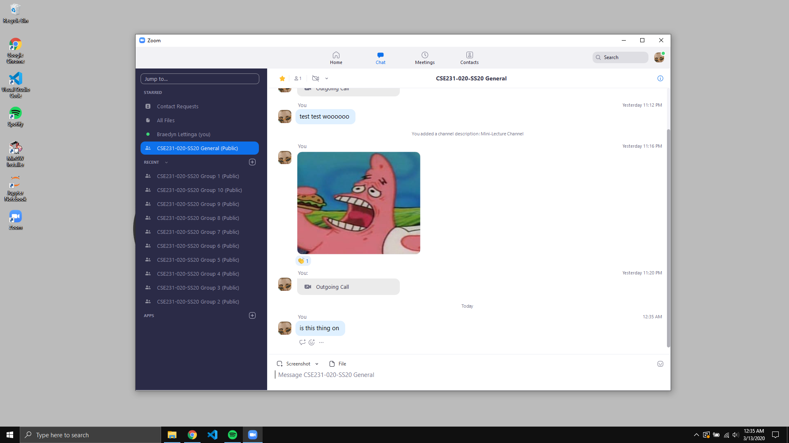

Subject: CSE231 Sec 020 - Important Lab Information (Week of 3/8/2020)

Sent: Fri 3/13/2020 12:42 AM

\**This email has been edited due to a mistake that was previously written.*

__________________________________________

Howdy,

We *__ARE__* having lab today. This email contains important information on how we're going to operate, tentatively.

Bear with me here, I'm new to Zoom so don't be surprised if this first lab goes to shit. If you haven't yet registered for Zoom, you can do that here: https://msu.zoom.us/ . Our meeting credentials are below: (make sure you create a Zoom account associated with your MSU login. If you see a page that requests your "company domain", ours is "msu")

Meeting ID: 275-988-897

Meeting URL: https://msu.zoom.us/j/275988897

I'll be putting this on Piazza and the GitHub page in a bit. If you don't know how Zoom works, there should be some informational resources about it on the Zoom website. Feel free to contact me about it if you're having trouble.

Alrighty, here's how we're going to do things for the time being. Some of this is subject to change -- I want your guys' feedback after we go through our first lab like this. 

For our section, I created Zoom Channels where, after my "mini-lecture", you guys can splinter off and work together on the lab. I *believe* you have to download the Zoom desktop client to access the channels -- I could be wrong, there might be some way to do that through the browser version. After my mini-lecture, I'll move to the "CSE231-020-SS20 General" channel where you guys can come in and request my help if you need it. You can of course just chill with me in the general channel and work on the lab assignment there, too. The other channels are aptly named "CSE231-020-SS20 Group X" where "X" is the group number, ranging from 1 to 10. I can make more if necessary. You should be able to just move freely from channel to channel, see what others are doing, claim a channel for your own, etc..  

On the Zoom desktop client, the channels look like this: (I'm currently in the General one)

I made all of the channels so I have all of them listed on my sidebar. You should be able to add/delete these channels to your sidebar willy-nilly and enter any of them.

In terms of how lab will be assessed will be similar to the in-class lab. As you probably know, the lab grade is traditionally attendance-based. Dr. Enbody wants to keep this format and so we'll be conducting a group Zoom meeting at the same time as the traditional lab, __5:00 PM to 6:50 PM on Fridays__. Like the traditional lab, I'll have to do my mini-lecture and keep track of who attends. If you get finished early, you can of course leave the session early. If you're about to leave the session early, __make sure I know you finished__. 

Like traditional lab, contact me ahead of time if you're going to miss the meeting. This will usually mean that you'll have to complete the lab on your own time. 

I'll be starting the meeting itself at 4:30-4:45 PM each Friday, and I'll begin the mini-lecture at 5:00-5:05 PM. I'll be staying after 6:50 PM as well if you guys have anymore lingering questions relating to projects, Mimir exercises, etc.. 

Since this week has been wild af, I'll be giving anyone who forgot to do the pre-lab credit for it this week. If you're running into trouble setting up Zoom and can't make it to this first meeting, contact me. 

See you guys in a bit,

Braedyn Lettinga
