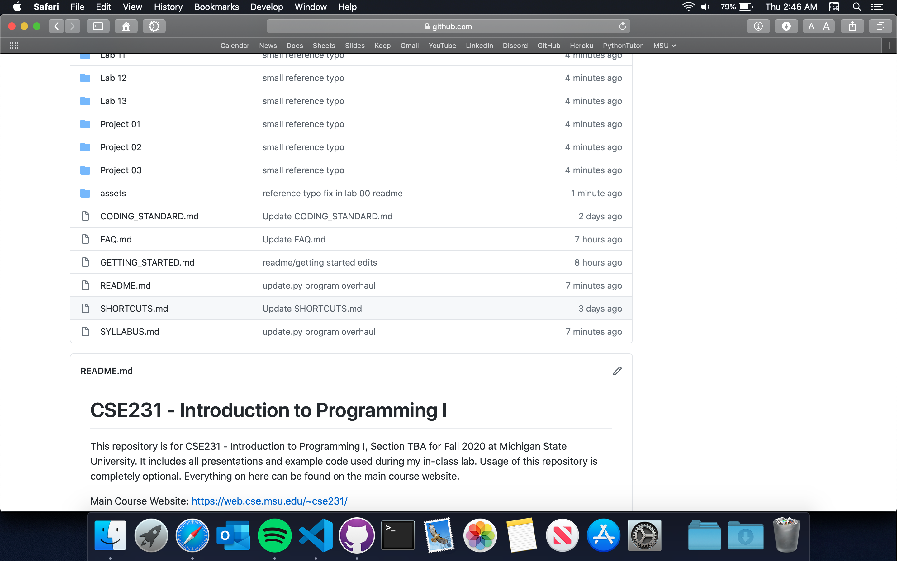

# Getting Started

Welcome to CSE231! I'll be hitting you with _a lot_ of information here, I apologize ahead of time. 

This is a hybrid ("flipped") course. Instead of traditional lectures, we have videos and readings. The videos are _supplemental_ to the text. Each week, you will:
- Read a particular chapter from the book, and watch the associated videos
- Attend the lab with your TA, and complete the week's pre-lab/lab assignment (collaborative)
- Complete some chapter exercises (collaborative)
- Complete a project (individual)

Please read through the [syllabus](SYLLABUS.md) if you haven't already. Below, I'll elaborate more on where things are and how they're graded.

All lab and project materials can be found in the "Code" section of this repository (there should be a tab near the top of the page). Once there, you should see a listing of folders dedicated to all labs and the currently drafted projects (if on mobile, tap the "View code" text). This will bring you to the home (or "master") folder. It should look something like this:

</img>

I typically use "slash notation" to represent folder/file paths in my logistical explanations. So `/Lab 01/` means I'm referring to the "Lab 01" folder, and `/Lab 01/presentation/` means the "presentation" folder inside the "Lab 01" folder. Whenever I use "XX", I'm typically referring to a variable number. So as an example, `/Lab XX/` refers to any and all lab folders, `/Project XX/` refers to any and all project folders, etc.. 

The file you're reading right now is contained within the home folder. Since it's a file, and not a folder, it would be expressed as `/GETTING_STARTED.md` with no slash at the end.

## Grading

**Important**: to be eligible for a non-zero course grade, a student must earn at least 50% of the total points on exams, and earn at least 50% of the total points on computer projects.

**Important**: students who get a zero ("no credit") on more than two laboratory exercises will have their course grade reduced by 0.5 for _each laboratory exercise missed beyond two_. For example, if a student had sufficient points to normally earn a 3.0, but obtained four zeroes on the laboratory exercises, that student's grade will be reduced by 2\*0.5, i.e. they will earn a 2.0 course grade.

Grade breakdown (Fall/Spring Semester):
  
|         | Chapter Exercises | Projects | Exam 1 | Exam 2 | Exam 3 | Total |
| :---:   | :---:             | :---:    | :---:  | :---:  | :---:  | :---: |
| Percent | 10%               | 45%      | 10%    | 15%    | 20%    | 100%  | 

Grade breakdown (Summer Semester):

|         | Chapter Exercises | Projects | Exam 1 | Exam 2 | Total |
| :---:   | :---:             | :---:    | :---:  | :---:  | :---: |
| Percent | 10%               | 45%      | 15%    | 30%    | 100%  | 

### Where are the grades?

Pre-lab, lab and project grades will be posted on D2L by yours truly. Mimir has a gradebook page of its own, which will simply serve as a reflection. Your "real" grades will be posted to D2L. 

If you want to discuss a grade you had recently received, or if there is a mismatch between your Mimir and D2L grades, contact [me](README.md#braedyn-lettinga) -- not the professors. 

### Pre-Labs

- Hosted On: D2L
- Graded By: D2L
- Assignment Style: Multiple Choice
- Collaboration: Allowed

Pre-labs are small multiple choice assignments intended as warm-ups for the real lab. They're to get you thinking about the concepts, and double as practice for the exams (the exam questions follow a _very_ similar format). Pre-labs can be retaken an infinite number of times before the deadline. There is an associated pre-lab for every lab, and are (for some reason) hosted on D2L. 

From the syllabus:
> Pre-labs are "warm-ups" for the labs and are not expected to be perfect -- our expectation is intentionally fuzzy for the pre-labs. You are expected to get most of them correct, most of the time.

### Labs

- Hosted On: Submissions on Mimir, procedure and starter-code in folder /Lab XX/. 
- Graded By: Mimir, TA
- Assignment Style: Coding
- Collaboration: Allowed

Labs are meant as practice material for all other assignments in the course. Because of this, labs are graded leniently, and follow a pass/fail scheme. The way labs are treated is dependent on your semester (see below). Lab submissions are on Mimir, and have test-cases so that you may check your work. Labs can be submitted an infinite number of times before the deadline.

From the syllabus:
> Students who get a zero ("no credit") on more than two (2) laboratory exercises will have their course grade reduced by 0.5 for _each laboratory exercise missed beyond two_. For example, if a student had sufficient points to normally earn a 3.0, but obtained four (4) zeroes on the laboratory exercises, that student's grade will be reduced by 2\*0.5, i.e. they will earn a 2.0 course grade.

**Summer Semester, 730 Sections**

Labs are treated as homework assignments. The due dates for all are reflected on the course schedule and Mimir. 

**Fall/Spring Semester, Sections 001-025**

Labs are not homework assignments. You may read through the procedure and begin planning beforehand, but you may not begin coding. You'll do the lab assignments with me and your classmates at the scheduled meeting time (whether that be in-person or online).  

If meetings are online for whatever reason, (e.g. COVID-19), you can miss the meeting _in exchange_ for 100% test-case completion. Anything less will be regarded as a 0%, even if sufficient effort was put in. 

### Chapter Exercises (10%)

- Hosted On: Mimir
- Graded By: Mimir
- Assignment Style: Coding, Multiple Choice
- Collaboration: Allowed

Chapter exercises are relatively small coding/multiple choice assignments on Mimir that ask about the fundamental concepts you learned for the week. The programs you must create are described in the assignment itself. 

When coding is necessary, Mimir will give you an integrated code editor. You may code on a local code editor, (like Spyder), but you'll ultimately have to copy-paste your code from Spyder into Mimir's integrated window for feedback. Test-cases are provided. 

The TAs do _not_ grade chapter exercises. Any and all points are accrued from the test-cases (or if the option you selected was correct, in the case of a multiple choice question). 

### Projects (45%)

- Hosted On: Submissions on Mimir, procedure and starter-code in folder /Project XX/.
- Graded By: Mimir, TA
- Assignment Style: Coding
- Collaboration: Disallowed

Projects are larger coding assessments that test your problem-solving abilities with the concepts you learned from the preceding week. 

Collaboration is strictly prohibited. Project files are sent to an online system that checks for similarities between other student project files (including ones from past semesters) and numerous websites (e.g. Chegg, StackOverflow, YahooAnswers, etc.). If your project is too similar to another source, an academic dishonesty report will be filed with the university, and you will receive a 0% overall course grade (see [FAQ](#FAQ.md)).

Unlike labs, project test-cases are treated with much more weight. You should strive to pass all of them. If a test-case is missed, the TA will look for partial credit opportunities. The amount of partial credit rewarded is dependent on a number of factors, however (e.g. what kind of mistakes were made, what would be required to fix it, etc.). 

If your _vital_ outputs are correct (i.e. values you could only obtain through an algorithm that had to be developed), but there are small spacing/formatting descrepancies in your output strings, I will recover most, if not all points for the affected test-case(s). I'm expecting that most of your output strings are correct.

### Exams (45%)

All issues related to the final exam will follow the policies and schedule of the University.

If there are in-person meetings: we will have paper multiple choice exams. See the [exam information section of the home README](README.md#exam-information) for locations/times. 

If there are no in-person meetings: exams will be on Mimir, and will contain both multiple choice and coding questions. You will be proctored through Zoom. See the [exam information section of the home README](README.md#exam-information) for times. 

You will be allowed one sheet of notes (8.5x11 inches) both sides, but no electronic devices. Non-native English speakers may bring a paper dictionary.

The amount of points per question varies by exam format, and which exam it is. In all cases, you should review the [past exams](https://web.cse.msu.edu/~cse231/Online/Exams/). If you'll be taking the exam on Mimir, I recommend going back through labs, projects, and chapter exercises (doing them if you never did, or designing alternate methods if you have all of them completed).

## Next Steps

You'll want to download and install [Anaconda](https://www.anaconda.com/products/individual), a software package that include an application called "Spyder". Spyder is the code editor that we'll be using for this class. Further instructions are in [Lab 00](Lab%2000).

Chapter exercise, lab, and project submissions are on Mimir. In order for your Mimir account to link with our system, you must navigate to the [CSE231 D2L page](https://d2l.msu.edu/d2l/home) and click the Mimir link from there.

If you have RCPD accommodations, please email them to either Dr. Enbody (enbody@cse.msu.edu) or Dr. Zaabar (zaabarim@cse.msu.edu).

Read through the [FAQ](FAQ.md) if you have any questions. If the FAQ doesn't have what you're looking for, please contact me (letting4@msu.edu)!

Hopefully you're all set now! The home folder and its README is intended as a hub for everything you'll need in this course. There is a course schedule on the home README that you'll want to keep a close eye on. I encourage you to browse the folders and home README, just to get a sense of where everything is. I'm looking forward to meeting you!

To home: https://github.com/braedynl/CSE231-GITHUB
