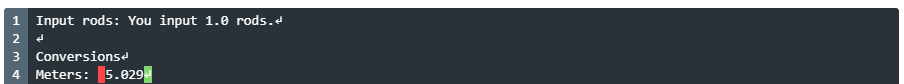

# Project 1

Due: Monday, September 14th (9/14/2020)

Video introduction: https://www.youtube.com/watch?v=YCpNh2DkRGM

Projects are meant to be completed alone. Collaboration and/or copying code from online, (e.g. Chegg), is strictly prohibited. A plagiarism-checker is ran through all projects, and checks for similarities between other students in the course and many online sources. 

Contacting [your TA](../README.md#braedyn-lettinga), using [Piazza](https://piazza.com/), and attending [help room](https://web.cse.msu.edu/~cse231/Online/General/ta.consulting.SS20.html) is encouraged if you are struggling. Take full advantage of `print()`, [PythonTutor](http://pythontutor.com/visualize.html#mode=edit), and your code editor's debugger (taught in [Lab 02](../Lab%2002)). 

Always read through **all** of the PDF instructions _carefully **and** thoroughly_. If you are having trouble comprehending the instructions, please don't hesitate to ask us on Piazza.

Starter-code is given for certain projects. If the project's Python file is empty, that means there is no starter-code for the project. In the case that some starter-code is given, you will want to _add_ to what's already written. Lines that _are_ written are there to help.

When submitting to [Mimir](https://class.mimir.io/), ensure that your file is properly named. The format is "projXX.py", where "XX" is the project's corresponding number. A leading zero is used for single-digit project numbers, and alphabetical characters are always kept as lowercase. If you download the files directly from this repository, this shouldn't be much of an issue, as I have scripts that properly name them for you.

With every project, a [`strings.txt`](strings.txt) file is included so that you can match Mimir's expected output precisely. Capitalization and spacing *does* affect whether Mimir marks your outputs as correct, and so this file is supplied to help mitigate the potential hassle you might have to go through correcting small errors like that. 

If you see these two lines at the bottom of a project file:

```python
if __name__ == "__main__":
    main()
```

.. do **not** delete them. Deleting these lines will result in a SIGPIPE error on Mimir (an indication that your program ran for an infinite amount of time -- can also occur if Mimir can't find your project file, or your program asked for an `input()` where Mimir wasn't expecting to input anything).

## Mimir Test-Case Explanation, Fixing Diff Descrepancies

When you click on a Mimir test-case, it will show a few things: the input of the test-case (what Mimir tried entering to your `input()` prompt(s)), your code's output (self-explanatory), the correct output of the test case (what you *should* be outputting based on the input(s)), and two "diff" windows.

Think of diffs as small programs that examine the *diff*erences between your code's output and the expected output. The "unix diff" shows what lines in your output (the top-half, above the "`---`") are different from the lines in the expected output (the bottom-half, below the "`---`"). I would simply look at the unix diff window for this purpose only. The codes that you'll see, like "`3,2c4,9`", tend to be hard to understand for most new programmers. The "pretty diff" is much more understandable in my opinion. You can read more about the unix diff [here](https://www.computerhope.com/unix/udiff.htm). 

The pretty diff "is colored to make it clear what parts of the output are wrong. Green indicates things in the correct output that you are missing, red indicates things in your output that shouldn't be there ... The ↵ character refers to newlines". The "newlines" they mention in this explanation is in reference to this: "`\n`" -- the newline _character_ (it's two separate characters but think of it as just one). The newline character essentially tells your computer to hit the RETURN/ENTER key. Here's an example:

Without a newline:
```python
print('hello')
print('hello again')
```
Output:
```
hello
hello again
```

With a newline:
```python
print('hello\n')  # <--
print('hello again')
```
Output:
```
hello

hello again
```

It's important to note here, that the `print()` function will _add_ a newline *for you* by default. This is the reason why subsequent `print()` expressions output on separate lines. You can change this behaviour by invoking the `print()` function's "`end`" parameter. 

Without `end`:
```python
print('hello')
print('hello again')
```
Output:
```
hello
hello again
```

With `end`:
```python
print('hello', end='')  # setting 'end' to empty string
print('hello again')
```
Output:
```
hellohello again
```

Likely the most common pretty diff discrepancy you'll encounter is an unintentional space nested within your output strings. Let's say I'm working on Project 01, and this is what I have so far:

Code:
```python
rods = float(input('Input rods: '))
print("You input", rods, "rods.\n")

meters = rods * 5.0292

print("Conversions")
print("Meters: ", round(meters, 3))
```
Mimir test-case:


Pretty diff:



There is a space, (highlighted in red), but how did it get there? Let's take a look at the line of code that's outputting this:

```python
print("Meters: ", round(meters, 3))
```

You'll notice we have a space directly after the colon, which is what we want, but where is the extra space coming from? Well, when you comma-separate values in the `print()` function, Python will insert a space in-between those two values. Example:

```python
print(1, 2, 3)
```
Output:
```
1 2 3
```

We can alter this behaviour in a variety of ways. I typically use the "`sep`" parameter of `print()`, which sets the string to insert between comma-separated values in the function call. 

```python
print(1, 2, 3, sep='')  # setting it to empty string
```
Output:
```
123
```

In the case of our project file, we could also remove the space after the colon to achieve the same effect:

```python
print("Meters:", round(meters, 3))
#             ^ without space

# alternate: `print("Meters: ", round(meters, 3), sep='')`
#                           ^ with space
```
Output:
```
Meters: 5.029
``` 

## Useful Keyboard Shortcuts

If you're on MacOS, all shortcuts involving CTRL use CMD instead, unless specified otherwise. Some of these shortcuts may vary between code editors -- the following are all shortcuts for Spyder. There are corresponding buttons in the Spyder menus for all of these.

**Indentation**
- TAB
    - Indent
- SHIFT + TAB
    - Un-indent
- CTRL + ]
    - Indents current/highlighted lines
- CTRL + [
    - Un-indents current/highlighted lines

Hitting ENTER (or RETURN) after a colon ("`:`") will automatically indent the next line for you in most code editors.

**Convenience**
- CTRL + 1
    - Comments/Un-comments current/highlighted lines
- CTRL + C
    - Copies highlighted text onto clipboard
- CTRL + V
    - Pastes text from clipboard
- CTRL + F
    - Finds all occurences of a given string of text
- CTRL + R
    - Finds and replaces all occurences of a given string of text with a new string of text

**Logistical/Debugging**
- F5
    - Execute file
- CTRL + F5
    - Execute file with debugger (runs program up until the first breakpoint)
- CTRL + F10
    - Steps debugger one line forward (you cannot go backwards)
- F12
    - Set/clear line breakpoint
- CTRL + F12
    - Steps debugger until next breakpoint
- CTRL + SHIFT + F12
    - Stop debugging
- CTRL + S
    - Save file
- CTRL + SHIFT + S
    - Save file as
- CTRL + C (in console, CTRL + C on MacOS)
    - Halts file execution, useful if your program is infinitely looping, or you want to stop it early for whatever reason
- CTRL + . (in console)
    - Restarts the console (kernel), useful if the console crashes and/or is misbehaving

**Cursor Navigation**
- Right Arrow
    - Shift cursor one character right
- Left Arrow
    - Shift cursor one character left
- Up Arrow
    - Shift cursor up one line
- Down Arrow
    - Shift cursor down one line
- SHIFT + Right Arrow
    - Highlight one character right
- SHIFT + Left Arrow
    - Highlight one character left
- CTRL + Right Arrow
    - Shift cursor one word right
- CTRL + Left Arrow
    - Shift cursor one word left
- CTRL + SHIFT + Right Arrow
    - Highlight one word right
- CTRL + SHIFT + Left Arrow
    - Highlight one word left